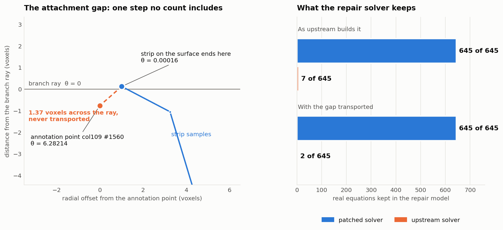
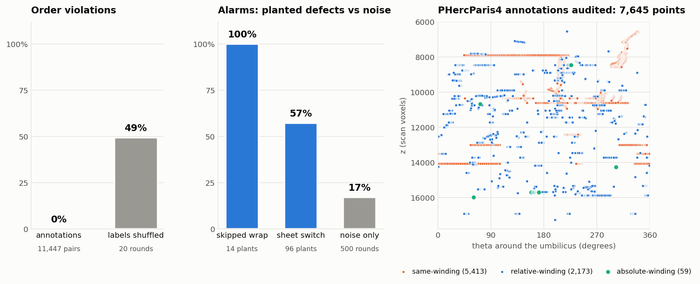

# windaudit

### Exact, frame-invariant audits of winding constraints — no GPU, no checkpoint, before the spiral fit

*Vesuvius Challenge progress-prize submission, September 2026. Author: Sergei Evland. MIT licence.*

windaudit is a quality-control layer for the winding constraints that drive the spiral fit. It reads the same files the fit reads, turns them — and, without any fitted checkpoint, the public patch surfaces they attach to — into one exact integer constraint graph, and proves where that graph contradicts itself. Every contradiction is a certificate checkable by addition: a cycle whose winding offsets do not sum to zero cannot have all its equations right. The patch-level check is proven independent of the angular frame, so what it finds in scan coordinates is what a correctly transported diagnostic finds through any fitted transform.

## Why this makes scrolls easier to read

A spiral fit inherits every winding error it is given: one ladder off by one, or one trace that slips onto the neighbouring wrap, folds the unrolled surface, and the failure shows up hours later as a bad segment with nothing pointing back at its cause. windaudit stops bad winding constraints — and false repairs recommended by the current diagnostic — from entering the fit. On real PHercParis4 data it identifies a false contradiction created by upstream's `find_inconsistent_windings.py`, and shows that following the edit that tool recommends would break two otherwise consistent cycles. It runs before the expensive fit, on a CPU, without a checkpoint or GPU, and returns exact locations to review in VC3D.

## Reviewer summary

| | |
|---|---|
| **Data** | PHercParis4: all 7,645 public winding-annotation points, and a pre-bounded sample of 1,639 public patch surfaces (1,637 retained after masking and band intersection) |
| **New capability** | An exact, pre-fit audit of winding constraints with no GPU and no checkpoint: every contradiction is a certificate checkable by addition, and patch-level contradictions are proven independent of the angular frame |
| **Why it matters** | Bad constraints and false diagnostic repairs are caught before they reach the spiral fit, with coordinates for VC3D |
| **Real-data result** | As upstream builds the graph: 3 inconsistent cycles and 2 recommended edits. With the missing transport term added: 1 cycle and 1 edit, and the other recommended edit is shown to break two cycles that are consistent once the term is added |
| **Upstream impact** | Three defects in `find_inconsistent_windings.py` found by the audit: a candidate patch for the two solver defects, failing before and passing after on villa `main` as of 20 September 2026 (`23c3d759`); a tested correction and an implementation specification for the third |
| **Evidence** | 645 equations, 342 fundamental cycles, 3 frame transforms with 0 unexplained changes, 319 tests passed and 1 skipped, solver tests passing in three Python/NumPy/SciPy environments, every input and result pinned by SHA-256 |
| **Integration** | Reads the four input files the spiral fit reads, exports upstream `vc_pointcollections_json_version` 1 collections the fit loads, and audits the full annotation corpus in about two seconds |



## Check it yourself

**In 30 seconds, without any scroll data** — reproduce both solver defects on the pinned upstream file bundled in `upstream/villa/`, then fix them with the candidate patch:

```bash
mkdir -p villa-check/spiral-fitting
cp upstream/villa/find_inconsistent_windings.py villa-check/spiral-fitting/
cd villa-check
python ../upstream/check_solver.py spiral-fitting/find_inconsistent_windings.py
#   "large_offset_consistent_graph": false, "retain_uneditable_equations": false   -> exit 1
git apply ../upstream/solver-candidate.patch
python ../upstream/check_solver.py spiral-fitting/find_inconsistent_windings.py
#   "large_offset_consistent_graph": true,  "retain_uneditable_equations": true    -> exit 0
```

The same two commands work in a checkout of ScrollPrize/villa at the pinned commit `2dcfaf6a` or at `main` as of 20 September 2026; the file is byte-identical in both.

**The contradiction, by addition.** `results/wide_corrected/certificates.json` lists each step of the surviving certificate with its signed contribution: +1 and −2, sum −1. No code is needed to check it.

**Everything, on real data** — 236 MB of public patch surfaces, fetched once and checked file by file, after which every step runs offline:

```bash
python -m pip install -e ".[dev]"
python scripts/verify_repo.py           # every shipped file against its hash
python -m pytest -q                     # 319 passed, 1 skipped
python scripts/fetch_data.py            # the public patch surfaces, each checked against its SHA-256
bash scripts/reproduce_wide.sh          # the real patch graph, both constructions, both solvers
bash scripts/reproduce_invariance.sh    # the frame-invariance test on both constructions
bash scripts/reproduce.sh               # every annotation number
```

`verify_repo.py` checks this release's manifest, then the two measurement-time manifests written when the results were produced; those predate later documentation edits, which it lists as expected, and it ends with "All code and result files match every manifest."

## 1. A patch-level audit that needs no checkpoint

Upstream's `strip_winding_delta` multiplies each θ = 0 crossing by `dr_per_winding` and divides by it again, so the integer it returns is a signed crossing count — taken after the fitted transform, which moves the branch ray. Individual counts therefore depend on the frame. What a diagnostic needs does not: for any admissible transform — continuous, sending the umbilicus to the spiral axis and nothing else onto it, winding once around it — every graph equation changes only by a difference of per-patch gauges. Cycle sums, the set of contradictions, whether a subgraph is consistent, and which edit sets are optimal are identical in every admissible frame. So once every step is transported, the contradictions windaudit finds in scan coordinates are exactly the ones the diagnostic finds through any fitted checkpoint — no checkpoint needed. The proof is in [SCANSPACE_TRANSPORT.md](SCANSPACE_TRANSPORT.md); 81 tests cover its identities, and it was tested on the real graph under three smooth, position-dependent rotations about the umbilicus:

| Transform | Equation values changed | Changes not explained by patch gauges | Cycle sums | Solver outputs |
|---|---:|---:|---|---|
| Rotation varying with z | 17 of 645 | **0** | identical | identical |
| Rotation varying with radius | 119 of 645 | **0** | identical | identical |
| Rotation varying with z, radius and angle | 57 of 645 | **0** | identical | identical |

The proposition needs every piece of every closed walk to be transported and no sampled step to turn by π or more. The second is checked on every run: across 6,223,592 valid quads and 24,287,474 centre-graph edges, every elementary cycle closes exactly, and a synthetic surface that encloses the axis is required to fail the same check. The first is what the next section is about.

## 2. What it found on real PHercParis4 data

A real patch graph was built from a pre-bounded sample of 1,639 public patch surfaces (236 MB; 1,637 retained after masks, erosion and band intersection) and the unmodified public annotations: 3,523 annotation points attached, 335 patches reached, 645 measurable equations, 342 fundamental cycles. The pinned upstream functions `classify_pcl`, `build_rel_adjacency` and `solve_min_edge_fix` were run on it unchanged.

**A false contradiction, and the edit it leads to.** Built exactly as upstream builds it, the graph has three inconsistent cycles, and the frame test above fails on it — at one annotation point. Upstream counts branch crossings along each annotation at the annotation points' own coordinates, but starts and ends every within-patch strip at the point's attachment on the surface; the short segment between the two is counted by neither. At `col109` point 1560 (θ = 6.28214) the attachment, 1.37 voxels away, lies across the branch ray (θ = 0.00016), so two equations are each off by one winding and two spurious inconsistent cycles appear. The upstream diagnostic resolves them by recommending that `col106`, points 1530 → 1529, be changed from −1 to −2. With the missing transport term added, that edit **breaks two cycles that are otherwise consistent**.

| Graph construction | Inconsistent cycles | Frame-invariant | Edits recommended |
|---|---:|---|---:|
| As upstream builds it | 3 | no | 2 |
| Missing transport term added | 1 | **yes** | 1 |

This is a property of the construction, not of one scan frame: every fitted transform places its branch ray somewhere, and wherever it passes between a point and its attachment the same missing ±1 transport term can occur. Averaged over ray positions, this graph alone carries 0.087 such straddles per frame.

**The contradiction that remains.** One exact patch-level contradiction, involving two public relative-winding annotations, survives every frame and the correction. The two annotations tie the same two patches together and disagree by one winding:

| Step | Annotation | Points | Walked | Contribution | Attachment distances |
|---|---|---|---|---:|---|
| patch A → patch B | `col264` | 2882 → 2883 | as stored | +1 | 0.75, 1.80 voxels |
| patch B → patch A | `col208` | 2335 → 2337 | reversed | −2 | 1.67, 0.60 voxels |
| | | | **sum** | **−1** | |

Patch A is `auto_grown_20260521161130783_sel_20260521_161535_29` and patch B `auto_grown_20260521225553961_sel_20260521_225725_10`, at z ≈ 10,215–10,358. On both steps the branch correction is zero and the strip terms cancel, so the contradiction is carried entirely by the two annotations' own winding differences. Exactly two single edits repair it — changing either annotation — so windaudit labels both `possible`; it is the place to look in VC3D. Every certificate is written out with its signed step contributions in `results/*/certificates.json`.

## 3. Three upstream defects the audit exposed

**The attachment gap is never transported** — the defect described above. It is corrected and tested in the patch-graph harness (`WIDE_ATTACHMENT_GAP=1`), and [WIDE_SCANSPACE_AUDIT.md](WIDE_SCANSPACE_AUDIT.md) specifies the change in terms that carry over to upstream's code.

**The repair solver drops almost every real constraint.** `solve_min_edge_fix` is documented as restricting which edges may *change*. In the restricted mode upstream uses, the code instead leaves every non-editable edge out of the model, so the equations that pin the rest of the graph disappear. On the real graph it keeps 7 of 645 equations as upstream builds it, and 2 of 645 once the missing term is added:

| Graph with the missing term added | Upstream | Patched |
|---|---:|---:|
| Equations retained in the model | **2** of 645 | **645** of 645 |
| MILP inequality rows | 4 | 1,290 |
| Solver status | Optimal | Optimal |
| Graph consistent after the edit | Yes | Yes |

On this graph the editable edges happen to be enough, and both solvers return a valid one-edit repair. On other graphs they are not: the synthetic regression in `upstream/` shows the upstream solver closing one cycle by breaking another it never saw.

**The potential box can exclude the optimum.** Each patch potential is boxed around a BFS labelling, `big = max|u0 − mean(u0)| + m + 10`. On large-offset graphs the true optimum lies outside that box, and the solver reports the optimum of the wrong problem.

`upstream/solver-candidate.patch` fixes both solver defects — every equation stays in the model and only the edit is restricted, and the potentials get a bound valid for every admissible retained graph — and applies cleanly to the pinned revision and to `main` as of 20 September 2026. It touches a diagnostic, not `fit_spiral`'s optimisation. See [upstream/README.md](upstream/README.md).

## 4. The annotation corpus, audited end to end

All 7,645 annotation points of PHercParis4, with a configuration frozen and hashed before the report was produced:

| Check | Result |
|---|---|
| Within-collection radial order, 11,447 same-sector pairs | **0 violations** |
| Same control with labels shuffled inside each ladder | 49.4% violations, 20 rounds |
| Cross-collection same-sheet links inferred | **2,371** links over 98 collection pairs |
| Collection pairs whose links disagree on the offset | **0** |
| Independent annotation-graph cycles that fail to close | **0** of 27 |
| Same-winding traces stepping against their own trend | **2**, with coordinates |
| Runtime, core audit | **about 1–2 s** on a laptop or cloud CPU (`results/paris4/core_runtime.json`); the full validation run with planted defects and sweep takes 102 s |



The consistent remainder is exported as two-point collections the spiral fit loads directly, and every finding carries voxel coordinates for VC3D.

**windaudit measures its own power, on the corpus it audits.** At every boundary where the corpus carries independent evidence on both sides, it plants a skipped wrap and a sheet switch, in both directions, and reruns the whole pipeline: **14 of 14** skipped wraps and **55 of 96** sheet switches raise an alarm, and every planted skipped wrap lands on the review shortlist (mean 4.9 collections). Every repair claim carries a certainty label computed over the entire set of optimal repairs — `certain`, `possible` or `excluded` — checked against exhaustive enumeration in the test suite, so a reviewer knows whether a finding is forced or one of several explanations.

**And its noise rate.** With every relative and same-winding point jittered by an independent 1-voxel Gaussian, 86 of 500 rounds implicate a collection the clean run does not (17%, 95% interval 14–21%). The alarms concentrate on 10 of 384 collections, and three same-winding traces account for 65 of the 86 alarm rounds — so the null also names the few links that sit at the edge of tolerance (`results/frozen_null.json`).

The planted-defect sites are few — 7 and 48 boundaries out of 1,823 and 5,288 — because a constraint can only be cross-checked where independent annotations overlap it, and in PHercParis4 they rarely do. The audit reports that coverage per collection, which shows where new annotation effort pays off most. The patch graph in sections 1–3 is the way past it: surfaces, unlike annotations, overlap everywhere.

## Use it on your data

```bash
python -m pip install -e ".[dev]"
python -m windaudit run --inputs data/paris4 --out out/paris4
python scripts/compare_reports.py results/paris4/audit_report.json out/paris4/audit_report.json
```

For another scroll, point `--inputs` at its spiral-fitting dataset directory — or give `--relative`, `--same`, `--absolute` and `--umbilicus` individually — and set `--spiral-sense` to that scan's `spiral_outward_sense`. The audit reads the same four files the spiral fit reads, so it can run after every annotation session; `--skip-planted --skip-sweep` gives the two-second core audit.

`certified_links.json` and `review_queue.json` are byte-identical across reruns and across machines with different Python, NumPy and SciPy versions. Patch-graph comparison additionally allows for which of several equally optimal edits a solver build returns (SciPy 1.17.0 and 1.17.1 break the tie differently), and checks instead that each run's own edits are optimal and leave the graph consistent. The annotation package keeps version 0.2.1 so that its published exports keep their hashes; the patch-level tooling is additive and changes none of those bytes.

## How it works

1. **Frame.** Each point is placed around the umbilicus with the upstream spiral-fitting convention exactly: `theta = atan2(y, x)` in `[0, 2pi)`, the integer branch cut at `theta = 0`, `CW`/`ACW` sense. Labels are transported across the cut with signed crossing counts.
2. **Calibrate.** Wrap spacing is measured from the absolute anchors themselves — 23.30 voxels from 1,053 same-sector pairs. All radial tolerances are fixed multiples of it, so nothing is hand-tuned per scroll.
3. **Order audit.** Papyrus wraps do not cross, so inside a small sector radial order must follow winding order. Each wrap's local tilt is fitted and removed before any comparison.
4. **Same-sheet links.** Points of different collections that land on one wrap become links, each an exact integer equation between the two collections' gauges. Sectors where wraps crowd below the matcher's resolution are vetoed rather than guessed.
5. **Cycle proof.** Around every independent cycle the offsets must sum to zero; a nonzero sum is written out as a certificate naming the collections involved.
6. **Exact repair, with certainty labels.** Minimum quarantine and minimum edge cut are solved to proven optimality with HiGHS as lexicographic programs with a canonical tie-break, re-verified by an independent traversal, and classified over the whole set of optimal repairs.
7. **Patch level, without a checkpoint.** Integer transport across real patch surfaces in scan coordinates, attachment gap included, gated on exact integrability and invariant under any admissible frame.
8. **Review queue and export.** Findings carry coordinates; the consistent remainder is written in upstream's `vc_pointcollections_json_version` 1 format.

## Outputs

| File | Content |
|---|---|
| `results/wide/` | the real patch graph built exactly as upstream builds it, both solver runs, its certificates |
| `results/wide_corrected/` | the same graph with the attachment gap transported, the gap records, both solver runs, its certificate, the figure above |
| `results/frame_invariance/` | the frame test on both constructions |
| `results/paris4/audit_report.json` | every annotation statistic, input SHA-256, the frozen configuration and its hash, the planted-defect trials |
| `results/paris4/review_queue.json` | collections to inspect, with evidence and voxel coordinates |
| `results/paris4/certified_links.json` | the graph-consistent remainder as same-winding collections the spiral fit loads |
| `results/frozen_null.json` | the 500-round noise null, round by round |
| `upstream/` | the candidate solver patch, its check script and recorded before/after outputs |

## Related work

[winding-sync](https://github.com/abundantjoe/winding-sync) generates relative winding constraints directly from CT and reconciles them as L1 integer synchronisation. The verifier in [Herculaneum Scroll Tools](https://github.com/axiosdevs/herculaneum-scroll-tools) checks each constraint collection on its own. [winding-ruler](https://github.com/pscamillo/winding-ruler) measures winding evidence for a finished spiral fit, and [windcheck](https://github.com/joe-carr-data/windcheck) finds surface self-intersections. windaudit covers the step before an expensive fit — exact cross-collection certificates on the annotations people have already made, a frame-invariant patch graph that needs no checkpoint, and a measured statement of what the audit can see — and it is built to sit beside these tools.

## Scope

A failing cycle proves that its equations cannot all hold; which part is wrong — an annotation, an inferred link or a surface attachment — is for a reviewer in VC3D, and the certificate in section 2 gives the patches, points and coordinates to start from. Frame invariance is proved for all admissible transforms and tested under three synthetic ones, since no public spiral checkpoint was available. `certified_links.json` is a graph-consistent set of inferred links (`ct_verified: false` in its metadata), meant as a starting point for review. windaudit audits constraints; it does not change the spiral fit itself. An ordinal-constraint extension was evaluated against a pre-registered acceptance rule and ships disabled, kept as a documented negative result in [docs/negative-results/](docs/negative-results/ordinal-constraints.md); the protocol for a future downstream-fit comparison is in [docs/future/](docs/future/downstream-fit-protocol.md).

[METHODS.md](METHODS.md) defines every quantity. [SCANSPACE_TRANSPORT.md](SCANSPACE_TRANSPORT.md) has the transport and the invariance proof; [WIDE_SCANSPACE_AUDIT.md](WIDE_SCANSPACE_AUDIT.md) the patch-graph runs and the defects; [VALIDATION.md](VALIDATION.md) the log of every check; [THIRD_PARTY_DATA.md](THIRD_PARTY_DATA.md) data provenance and terms.

Code is MIT-licensed. Author: Sergei Evland.
